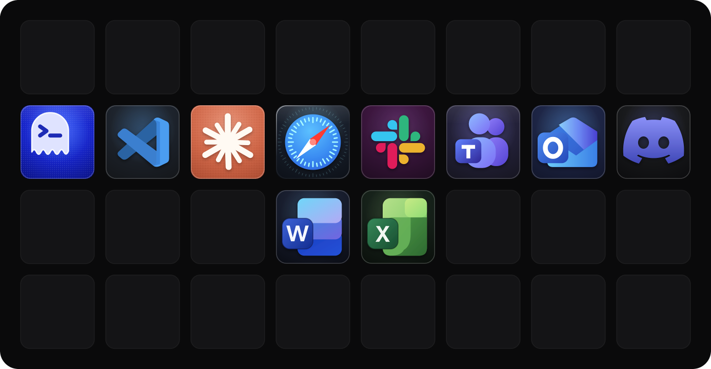
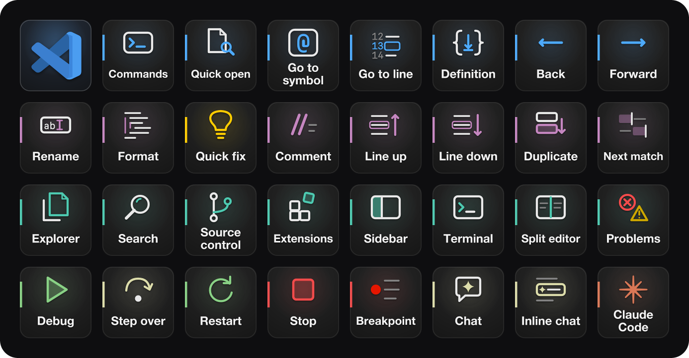
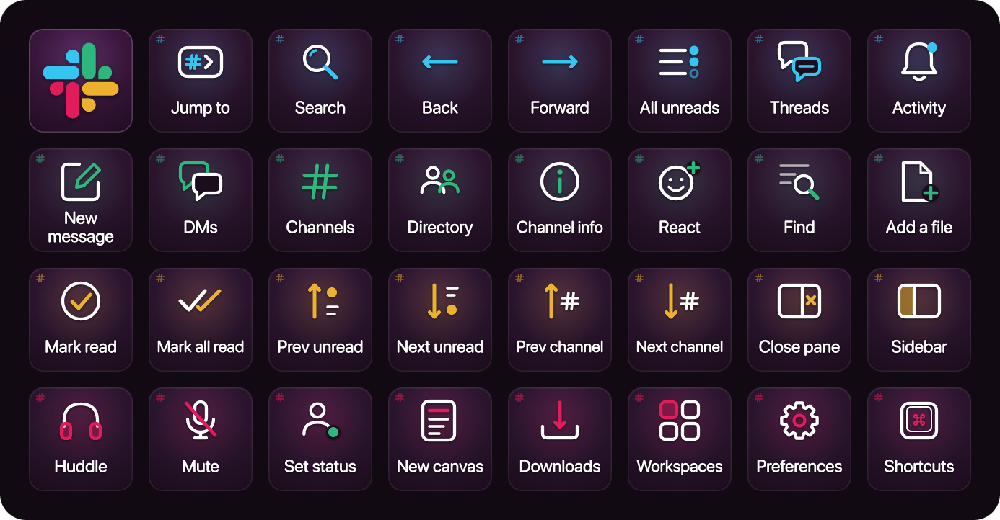
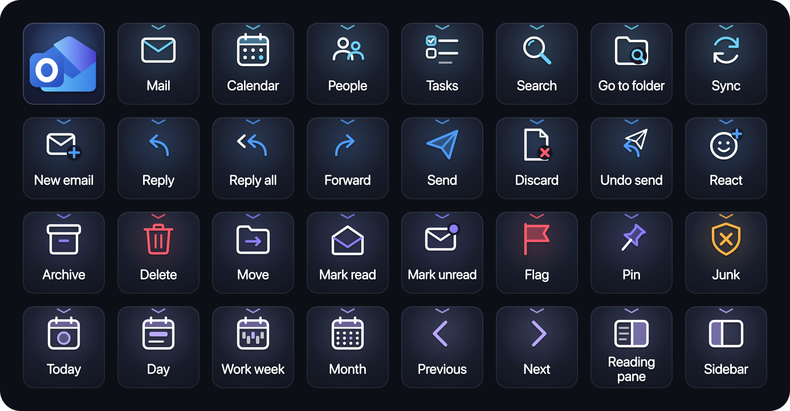
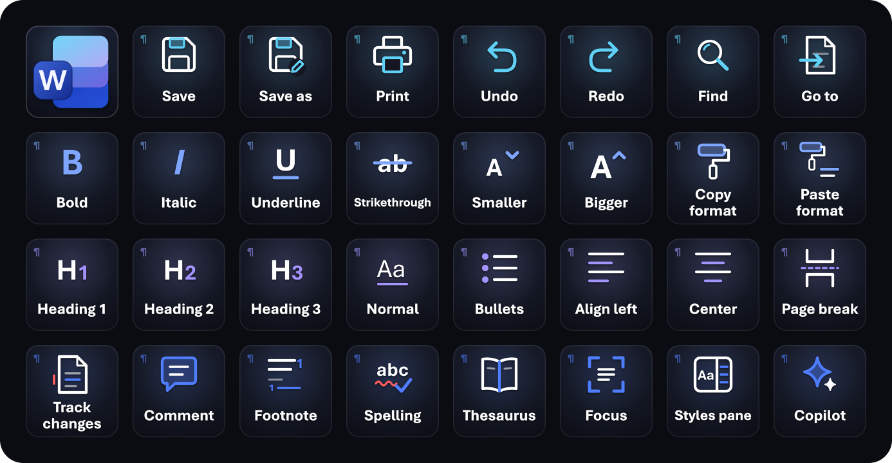
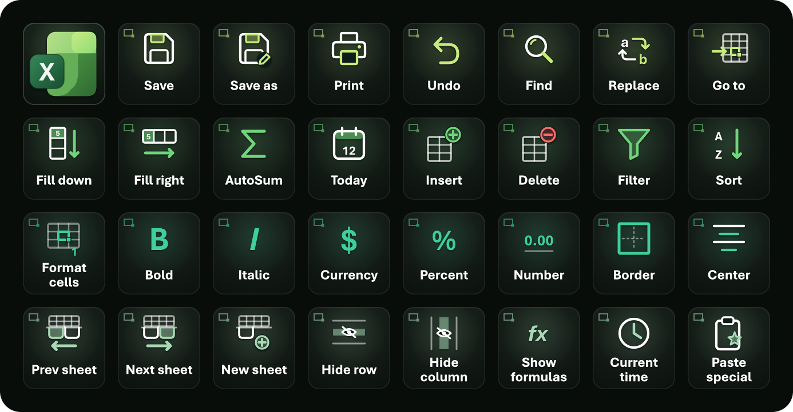

# streamdeck-profiles

Custom Elgato Stream Deck profiles with generated icon sets. Each profile lives in its own folder under `profiles/`, and contains:

- a ready-to-import `.streamDeckProfile`
- the icons (PNG) and their SVG sources
- the scripts that rebuild both
- an interactive mockup (`index.html`): click a key to see what it sends

## Profiles

| Profile | Device | Keys | Mockup | Preview |
|---|---|---|---|---|
| [Main](profiles/main/) *(launcher)* | Stream Deck XL | 10 | [live](https://claude.ai/code/artifact/7af261fc-6cdb-472a-bc91-6e06f6e4eb08) · [local](profiles/main/index.html) |  |
| [Ghostty](profiles/ghostty/) | Stream Deck XL | 32 | [live](https://claude.ai/code/artifact/0b677874-a30c-473f-9104-18c0ce02b17f) · [local](profiles/ghostty/index.html) |  |
| [Claude](profiles/claude/) | Stream Deck XL | 32 | [live](https://claude.ai/code/artifact/e322b528-abbb-4874-b1f0-8e6d39fe08c3) · [local](profiles/claude/index.html) |  |
| [Safari](profiles/safari/) | Stream Deck XL | 32 | [live](https://claude.ai/code/artifact/589a06e9-d96b-4750-b59f-a9a2613080eb) · [local](profiles/safari/index.html) |  |
| [Microsoft Teams](profiles/teams/) | Stream Deck XL | 32 | [live](https://claude.ai/code/artifact/d6fc463f-ecff-4b2e-b2ad-69d1c72d0579) · [local](profiles/teams/index.html) |  |
| [VS Code](profiles/vscode/) | Stream Deck XL | 32 | [live](https://claude.ai/code/artifact/212e3cf5-5667-4046-bbb9-e25a485e9352) · [local](profiles/vscode/index.html) |  |
| [Slack](profiles/slack/) | Stream Deck XL | 32 | [live](https://claude.ai/code/artifact/4877865c-049a-4959-ad8b-acfb9c6b964e) · [local](profiles/slack/index.html) |  |
| [Microsoft Outlook](profiles/outlook/) | Stream Deck XL | 32 | [live](https://claude.ai/code/artifact/c06c47c8-eab6-4ea0-8b83-4f8f52bf87a1) · [local](profiles/outlook/index.html) |  |
| [Discord](profiles/discord/) | Stream Deck XL | 32 | [live](https://claude.ai/code/artifact/36be267f-77fe-4bb5-a3e4-572d2e3ef490) · [local](profiles/discord/index.html) |  |
| [Microsoft Word](profiles/word/) | Stream Deck XL | 32 | [live](https://claude.ai/code/artifact/8188ebce-238d-437d-b4ac-860b02ad2787) · [local](profiles/word/index.html) |  |
| [Microsoft Excel](profiles/excel/) | Stream Deck XL | 32 | [live](https://claude.ai/code/artifact/166dc283-5955-49a2-b354-43fa1356d629) · [local](profiles/excel/index.html) |  |

The live mockups are private Claude artifacts, so only you can open them unless you share them. The local `index.html` files work offline from a clone.

## Install

**Main** is the home screen: one key per deck. Each key switches to that app's deck and brings the app to the front. On every app deck, the top-left key goes back to Main.

### Everything at once (recommended)

```bash
npm install
npm run backup
```

This writes `build/streamdeck-profiles.streamDeckProfilesBackup`. It holds all the profiles: Main is linked to *other applications*, each deck is linked to its app, and the Main keys and each deck's top-left key already point at each other. In the Stream Deck app, restore it from **Preferences → Profiles → Restore from Backup**.

- **Restoring replaces every profile on every device**, and the Stream Deck app can't undo it. The app keeps its own daily backups in `~/Library/Application Support/com.elgato.StreamDeck/BackupV3`.
- **Why a backup, not imports.** Importing a `.streamDeckProfile` gives it a new profile id, so keys that point at other profiles can't be set in advance. A restore keeps the ids it's given. `tools/backup.mjs` derives stable ids from each profile's folder name.
- **The backup contains your Stream Deck's serial number**, which every profile in a backup must carry. `tools/backup.mjs` reads it from your installed profiles, so at least one XL profile must already be installed. That's also why the output goes to the git-ignored `build/` folder.

### One profile

Double-click the `.streamDeckProfile` file in a profile's folder, or run:

```bash
open -a "Elgato Stream Deck" profiles/ghostty/Ghostty.streamDeckProfile
```

Then go to **Preferences → Profiles** and link the profile to its app, so it switches in automatically. A deck imported on its own has a top-left key with no target: select it and pick your Main profile. `Main.streamDeckProfile`'s keys need their deck picked the same way.

## Rebuild

Requirements: Node 18+, and for the Ghostty icons, the [JetBrains Mono Nerd Font](https://www.nerdfonts.com/font-downloads) installed in `~/Library/Fonts`.

```bash
npm install
npm run ghostty
```

`npm run ghostty` regenerates the icons (`gen.mjs`) and then the profile (`profile.mjs`). `npm run main` rebuilds the launcher, and `npm run backup` rebuilds the full backup from whatever is currently built.

After any change, run the deck's script, then `npm run main` if its top-left tile changed, then `npm run backup`, and restore the backup. Re-importing a single `.streamDeckProfile` instead adds a fresh copy with a new id, which breaks the keys that point at it.

## Adding a profile

AI agents: read [AGENTS.md](AGENTS.md) first. It's the full playbook: how the user likes to work, where to find an app's real shortcuts, the icon system, how to build and check the files, how to deploy through the backup, and the traps to avoid. `CLAUDE.md` loads it automatically for Claude Code. The short version:

1. **Mockup:**
   - Create `profiles/<name>/` with a `gen.mjs` that writes `icons/`, `svg/`, `keymap.json` and `sheet.png`.
   - Each key shows its glyph and name, sized by `tools/tile.mjs`. The shortcut isn't printed on the key.
   - The top-left key shows only the app's mark, filling the key. The launcher reuses that tile as is.
   - Add an `index.html` mockup and a README. Wait for approval.
2. **Build:**
   - Copy the closest deck's `profile.mjs`, then update `KEY`/`SEND`, the profile `Name` and the top-left key's id.
   - Add `<name>:icons`, `<name>:profile` and `<name>` to `package.json`, and a row to the table above.
3. **Launcher:** add the deck to `APPS` in `profiles/main/gen.mjs` and to `DECKS` in `tools/backup.mjs`, then run `npm run main`.
4. **Deploy:** run `npm run backup`, check it, and restore it in the Stream Deck app.
5. **Commit:** scan the staged diff for personal paths and serials, then commit and push.

## Profile format notes (Stream Deck 7.x)

Figured out from real ProfilesV3 data and confirmed with a successful import on 7.5.1:

- **Container.** A `.streamDeckProfile` is a zip:
  ```
  package.json
  Profiles/<UUID>.sdProfile/
    manifest.json
    Profiles/<PAGE-UUID>/
      manifest.json
      Images/
  Resources/manifest.json
  ```
- **`package.json`** holds `AppVersion`, `DeviceModel`, `DeviceSettings`, `FormatVersion` (1), `OSType`, `OSVersion` and `RequiredPlugins`.
- **Device models.** Stream Deck XL is `20GAT9901`.
- **Actions.** Keys are addressed as `"col,row"`. Hotkey actions use the plugin `com.elgato.streamdeck.system.hotkey`, with four `Hotkeys` slots (unused slots: `NativeCode: -1`, `QTKeyCode: 33554431`).
- **Modifiers.** `KeyModifiers` is a bitmask: shift = 1, ctrl = 2, option = 4, cmd = 8.
- **Key codes.** `NativeCode` = `VKeyCode` = the macOS virtual keycode. `QTKeyCode` is the Qt key value (the unshifted character).
- **Switch Profile** (`com.elgato.streamdeck.profile.rotate`): `{"DeviceUUID": "", "PageIndex": 1, "ProfileUUID": "<target profile id, lowercase>"}`.
- **Multi Action Switch** (`com.elgato.streamdeck.multiactions.routine2`, plugin `com.elgato.streamdeck.multiactions`) has `Actions: [{Actions: [...]}, {Actions: [...]}]`, one list per state, and alternates between them on each press. Put the same steps in both lists to make every press identical.
- **Backups** (`.streamDeckProfilesBackup`) are an uncompressed zip of `Resources/manifest.json` plus `Profiles/<ID>.sdProfile/` folders, with no `package.json`. Each profile manifest adds `AppIdentifier` (an app path, or `*` for other applications) and the device serial in `Device.UUID`.
- **Open Application** (`com.elgato.streamdeck.system.openapp`). Its settings keys are `app_name`, `args`, `bring_to_front`, `bundle_id`, `bundle_path`, `exec`, `is_bundle`, `long_press` and `source`. These are the names Stream Deck 7.5 writes itself. If you use any other names, Stream Deck quietly replaces them with empty values, and the key does nothing.
