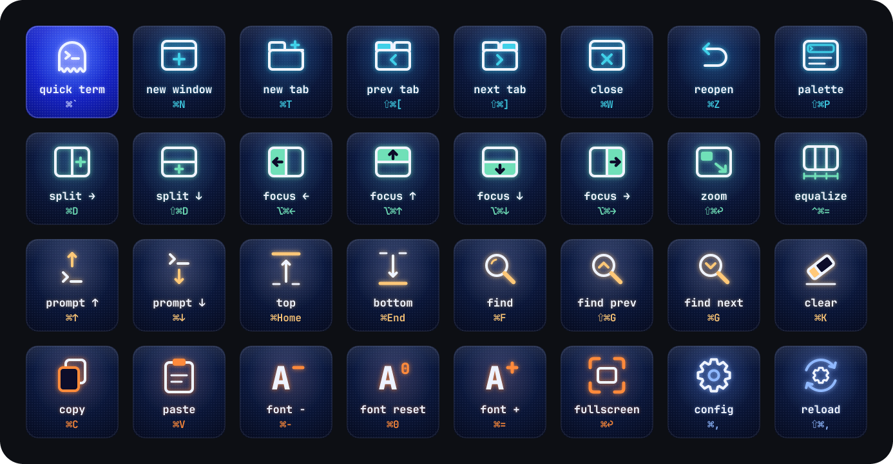
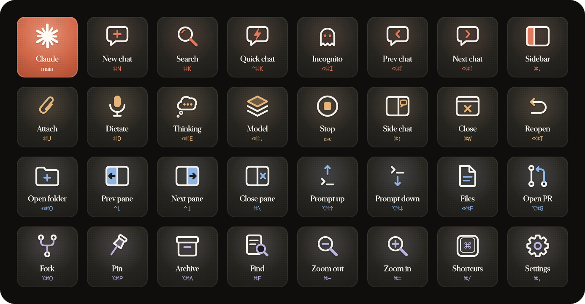
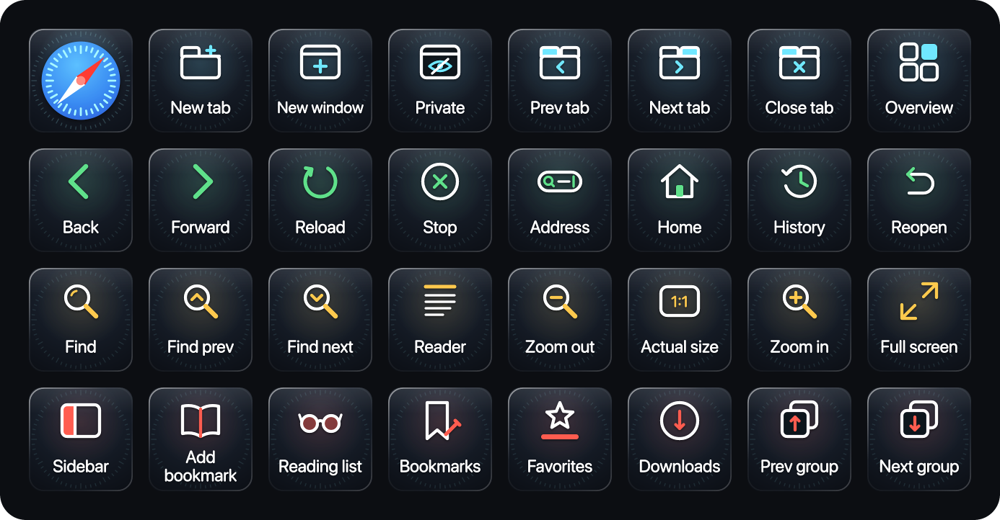
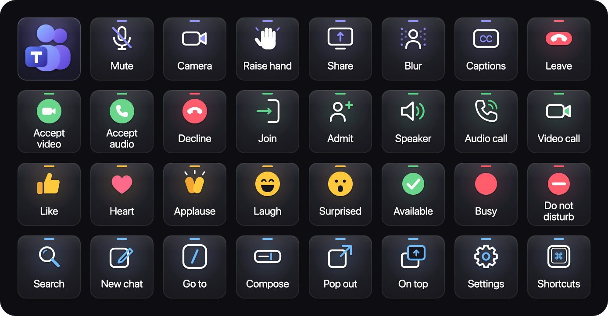

# streamdeck-profiles

Custom Elgato Stream Deck profiles with generated icon sets. Each profile lives in its own folder under `profiles/`, and contains:

- a ready-to-import `.streamDeckProfile`
- the icons (PNG) and their SVG sources
- the scripts that rebuild both
- an interactive mockup (`index.html`): click a key to see what it sends

## Profiles

| Profile | Device | Keys | Mockup | Preview |
|---|---|---|---|---|
| [Ghostty](profiles/ghostty/) | Stream Deck XL | 32 | [live](https://claude.ai/code/artifact/0b677874-a30c-473f-9104-18c0ce02b17f) · [local](profiles/ghostty/index.html) |  |
| [Claude](profiles/claude/) | Stream Deck XL | 32 | [live](https://claude.ai/code/artifact/e322b528-abbb-4874-b1f0-8e6d39fe08c3) · [local](profiles/claude/index.html) |  |
| [Safari](profiles/safari/) | Stream Deck XL | 32 | [live](https://claude.ai/code/artifact/589a06e9-d96b-4750-b59f-a9a2613080eb) · [local](profiles/safari/index.html) |  |
| [Microsoft Teams](profiles/teams/) | Stream Deck XL | 32 | [live](https://claude.ai/code/artifact/d6fc463f-ecff-4b2e-b2ad-69d1c72d0579) · [local](profiles/teams/index.html) |  |

The live mockups are private Claude artifacts, so only you can open them unless you share them. The local `index.html` files work offline from a clone.

## Install a profile

Double-click the `.streamDeckProfile` file in a profile's folder, or run:

```bash
open -a "Elgato Stream Deck" profiles/ghostty/Ghostty.streamDeckProfile
```

Then pick the profile in the Stream Deck app's profile dropdown. For app-specific profiles, go to **Preferences → Profiles** and link the profile to its app so it switches in automatically.

## Rebuild

Requirements: Node 18+, and for the Ghostty icons, the [JetBrains Mono Nerd Font](https://www.nerdfonts.com/font-downloads) installed in `~/Library/Fonts`.

```bash
npm install
npm run ghostty
```

`npm run ghostty` regenerates the icons (`gen.mjs`) and then the profile (`profile.mjs`). Each build creates new UUIDs, so re-importing adds a fresh copy of the profile rather than replacing the existing one.

## Adding a profile

AI agents: read [AGENTS.md](AGENTS.md) first. It's the full playbook: where to find an app's real shortcuts, the icon system, how to build and check the profile file, the import steps, and the traps to avoid. `CLAUDE.md` loads it automatically for Claude Code. The short version:

1. Create `profiles/<name>/` with a `gen.mjs` that writes `icons/`, `svg/`, `keymap.json` and `sheet.png`.
2. Copy `profiles/ghostty/profile.mjs`, then update the `KEY`/`SEND` hotkey maps, the profile `Name` and the device model.
3. Add `<name>:icons`, `<name>:profile` and `<name>` scripts to `package.json`, and a row to the table above.

## Profile format notes (Stream Deck 7.x)

Figured out from real ProfilesV3 data and confirmed with a successful import on 7.5.1:

- **Container.** A `.streamDeckProfile` is a zip:
  ```
  package.json
  Profiles/<UUID>.sdProfile/
    manifest.json
    Profiles/<PAGE-UUID>/
      manifest.json
      Images/
  Resources/manifest.json
  ```
- **`package.json`** holds `AppVersion`, `DeviceModel`, `DeviceSettings`, `FormatVersion` (1), `OSType`, `OSVersion` and `RequiredPlugins`.
- **Device models.** Stream Deck XL is `20GAT9901`.
- **Actions.** Keys are addressed as `"col,row"`. Hotkey actions use the plugin `com.elgato.streamdeck.system.hotkey`, with four `Hotkeys` slots (unused slots: `NativeCode: -1`, `QTKeyCode: 33554431`).
- **Modifiers.** `KeyModifiers` is a bitmask: shift = 1, ctrl = 2, option = 4, cmd = 8.
- **Key codes.** `NativeCode` = `VKeyCode` = the macOS virtual keycode. `QTKeyCode` is the Qt key value (the unshifted character).
- **Open Application** (`com.elgato.streamdeck.system.openapp`). Its settings keys are `app_name`, `args`, `bring_to_front`, `bundle_id`, `bundle_path`, `exec`, `is_bundle`, `long_press` and `source`. These are the names Stream Deck 7.5 writes itself. If you use any other names, Stream Deck quietly replaces them with empty values, and the key does nothing.
