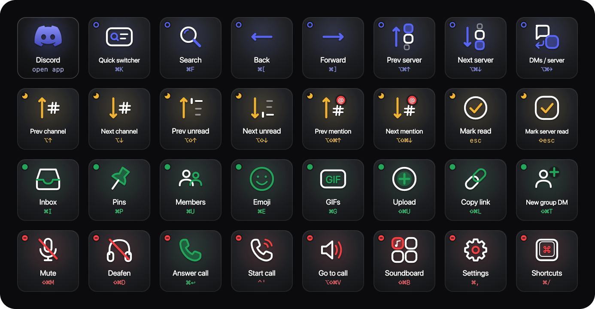

# Discord — Stream Deck XL

32 keys for Discord on macOS: moving between servers and channels, catching up on unreads and mentions, chatting, and voice. The tiles use Discord's own dark greys. Each row takes one of Discord's colours: blurple, then the idle yellow, online green and do-not-disturb red. The matching status indicator sits in the corner of every key, like the dot on an avatar.



Mockup: [live](https://claude.ai/code/artifact/36be267f-77fe-4bb5-a3e4-572d2e3ef490) · [local](index.html)

## Install

```bash
open -a "Elgato Stream Deck" profiles/discord/Discord.streamDeckProfile
```

- **Discord key.** This key opens Discord or brings it to the front. A long press quits it. If the key does nothing, edit it in the Stream Deck app and pick Discord again under **App / File**.
- **Link the profile** to Discord under **Preferences → Profiles**, so the deck switches to it when Discord is in front.

## Where the shortcuts come from

Every binding was read from the installed app: **Discord 0.0.411**, running web client **build 609489**.

- **The Mac menu** comes from `discord_desktop_core`'s `core.asar`. It only adds **Preferences ⌘,**. Everything else is generic Edit and View items.
- **The real keymap is in the web client.** The desktop app loads it from discord.com and caches it in `~/Library/Application Support/discord/Cache/Cache_Data`.
  - The cache uses Chromium's simple-cache format with a **24-byte** header, so the key starts at byte 24 and the body at `24 + keyLen`. The bodies are brotli.
  - Five builds were cached. The newest, `web.1cdc5503c78f74b8.js`, was used.
- **Two sources inside that bundle:**
  - the keybind action table, `{[IWg.TOGGLE_MUTE]: {binds: ["mod+shift+m"], …}, …}`. Some entries point at other modules, so those were resolved too.
  - the Keyboard Shortcuts sheet, grouped Navigation, Chat, Voice and video, and Miscellaneous. Its labels come from the cached English strings bundle.
- **`mod` means ⌘ on a Mac.** The bundle defines it as `isMac() ? "cmd" : "ctrl"`, and `alt` is ⌥.
- **Back and Forward** have a Mac-only binding (`isMac() ? ["mod+["] : ["alt+left"]`), so the deck sends ⌘[ and ⌘].
- **No overrides.** There are no `NSUserKeyEquivalents` set for `com.hnc.Discord`. The keybinds stored in Discord's local storage are only its default global binds (clip, screenshot and soundboard hold), and none are on this deck.

## Layout

| | 1 | 2 | 3 | 4 | 5 | 6 | 7 | 8 |
|---|---|---|---|---|---|---|---|---|
| **Navigate** | Discord *(open app)* | Quick switcher ⌘K | Search ⌘F | Back ⌘[ | Forward ⌘] | Prev server ⌥⌘↑ | Next server ⌥⌘↓ | DMs / server ⌥⌘→ |
| **Catch up** | Prev channel ⌥↑ | Next channel ⌥↓ | Prev unread ⌥⇧↑ | Next unread ⌥⇧↓ | Prev mention ⌥⇧⌘↑ | Next mention ⌥⇧⌘↓ | Mark read Esc | Mark server read ⇧Esc |
| **Chat** | Inbox ⌘I | Pins ⌘P | Members ⌘U | Emoji ⌘E | GIFs ⌘G | Upload ⇧⌘U | Copy link ⇧⌘L | New group DM ⇧⌘T |
| **Voice & more** | Mute ⇧⌘M | Deafen ⇧⌘D | Answer call ⌘↩ | Start call ⌃' | Go to call ⌥⇧⌘V | Soundboard ⇧⌘B | Settings ⌘, | Shortcuts ⌘/ |

## Notes

- **Esc does several jobs.** It closes whatever is open first: a menu, pop-out, modal or search. It also declines a ringing call. Only when nothing else is open does it mark the channel read.
- **Mute and Deafen** are Discord's in-app bindings, so they work while Discord is in front. The profile only shows then anyway. If you want a mute key that works from any app, set one in Discord under **Settings → Keybinds**.
- **Answer call** works only while a call is ringing. **Start call** works in a DM or group DM.
- **Server keys** have second bindings too, ⇧⌘[ and ⇧⌘]. If Discord's tab bar is on, ⌃Tab moves between tabs.

## Left out

- **⌘1–9 jump to servers by position**, so what they open depends on how you've arranged your server list. ⌘1 is always your DMs, and DMs / server covers that.
- **Message actions** (E edit, R reply, P pin, ⌫ delete, + react): they're single keys that need a message to be highlighted first.
- **Stickers ⌘S, Oldest unread ⇧PgUp, Mark top inbox read ⇧⌘E, Create or join a server ⇧⌘N, Collapse category ⇧⌘A, Back to voice ⌥⌘←, App directory ⌃⌘A, zoom ⌘+/⌘−/⌘0:** there's no room for them on 32 keys.
- **Push-to-talk and the other global keybinds:** they aren't set by default, and a Stream Deck hotkey can only tap, not hold.
