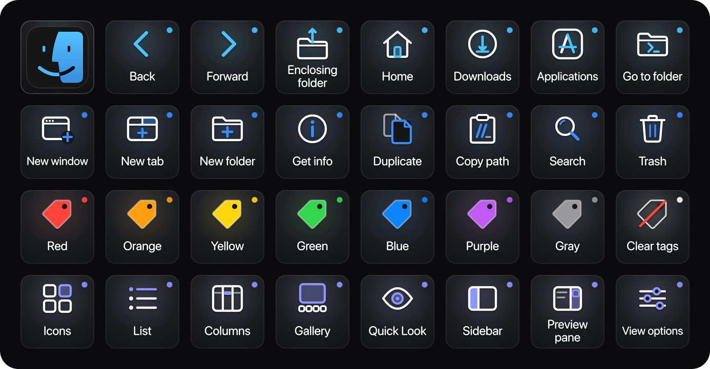

# Finder — Stream Deck XL profile

32 keys for the Finder on macOS: getting around, working with files, tagging, and views. The tiles are the Finder window's dark grey, with white line glyphs and SF Pro Rounded labels. Rows 1, 2 and 4 take their colour from the three blues of the Finder icon's face. The tags row uses the Finder's own tag colours, one per key. A small dot in the row's colour sits in each key's corner, the way the Finder marks a tagged file. The top-left key is the Finder icon itself.

The tags row sends no shortcuts. It uses the **Finder Tags** plugin (`me.hckr.findertags`), which is already installed.



Mockup: [live](https://claude.ai/code/artifact/aefca619-cedb-4927-bfcd-b2f23bc707ce) · [local](index.html)

## Install

```bash
open -a "Elgato Stream Deck" profiles/finder/Finder.streamDeckProfile
```

- **Finder Tags plugin.** The tags row needs the Finder Tags plugin by Jarno Le Conté, from the Stream Deck Marketplace. Without it, those eight keys do nothing.
- **Top-left key.** It goes back to the **Main** launcher, which has a key for every deck (a Stream Deck *Switch Profile* action). In the full setup (`npm run backup`, see the [repo README](../../README.md)) it already points at Main. If you import this file on its own, select the key in the Stream Deck app and pick your Main profile.
- **Link the profile** to the Finder under **Preferences → Profiles**, so the deck switches to it when the Finder is in front. The backup already links it. The Finder comes to the front whenever you click the desktop, so the deck appears then too.

## Where the shortcuts came from

- **App:** Finder 27.0 (`com.apple.finder`), in `/System/Library/CoreServices/Finder.app`, on macOS 27.
- **Menu file:** `Contents/Resources/Base.lproj/MenuBar.nib` (100 shortcuts) and `ArrangeByMenu.nib`, read with `tools/nib-shortcuts.py`. The Finder has no `MainMenu.nib`.
- **Live menus:** every key was then checked in the running Finder's menu bar through System Events. The File menu wouldn't answer a bulk query, so its items were read one at a time. The menu paths below are the live ones.
- **Your settings:** there are no custom shortcuts (`NSUserKeyEquivalents` is unset for the Finder and globally). The keyboard layout is British; `[` and `]` are on the same keys as on a US layout.
- **Tags:** Finder Tags 1.1.2 by Jarno Le Conté. What each action does was read from the plugin's source (`Sources/Plugin.swift`). Your tags still have their default names (Red … Gray), so the keys match them.

## Layout

| Row | 1 | 2 | 3 | 4 | 5 | 6 | 7 | 8 |
|---|---|---|---|---|---|---|---|---|
| **Go** (sky blue) | Finder *(Main)* | Back `⌘[` | Forward `⌘]` | Enclosing folder `⌘↑` | Home `⇧⌘H` | Downloads `⌥⌘L` | Applications `⇧⌘A` | Go to folder `⇧⌘G` |
| **Files** (blue) | New window `⌘N` | New tab `⌘T` | New folder `⇧⌘N` | Get info `⌘I` | Duplicate `⌘D` | Copy path `⌥⌘C` | Search `⌘F` | Trash `⌘⌫` |
| **Tags** (plugin) | Red | Orange | Yellow | Green | Blue | Purple | Gray | Clear tags |
| **View** (indigo) | Icons `⌘1` | List `⌘2` | Columns `⌘3` | Gallery `⌘4` | Quick Look `⌘Y` | Sidebar `⌃⌘S` | Preview pane `⇧⌘P` | View options `⌘J` |

Menu paths:
- **Go:** Go ▸ Back, Forward, Enclosing Folder, Home, Downloads, Applications and Go to Folder….
- **Files:** File ▸ New Finder Window, New Tab, New Folder, Get Info, Duplicate and Move to Trash; Edit ▸ Copy as Pathname and Search.
- **Tags:** Finder Tags plugin actions *Red Tag* … *Gray Tag* (`me.hckr.findertags.tag-<colour>`) and *Clear All Tags* (`me.hckr.findertags.clear-tags`).
- **View:** View ▸ as Icons, as List, as Columns, as Gallery, Hide / Show Sidebar, Hide / Show Preview and Show View Options; File ▸ Quick Look.

## Notes

- **A colour key toggles its tag.** It adds the tag to the selected files and folders, or takes it off if they already have it. **Clear tags** removes every tag, named tags included.
- The tag keys act on **what's selected in the Finder**. The plugin asks the Finder for its selection, so macOS may ask once whether Stream Deck can control the Finder.
- The plugin sets its own title on each colour key (the tag's name). The profile turns titles off, since the name is drawn on the key. After the build, check on the device that no second label shows.
- **Copy path** (`⌥⌘C`) names the item in the menu: *Copy “notes.txt” as Pathname*.
- **Sidebar** and **Preview pane** toggle, so their menu items read *Hide* or *Show* depending on the window.

## Left out

- **Empty Trash** (`⇧⌘⌫`, and `⌥⇧⌘⌫` without the prompt) and **Delete Immediately** (`⌥⌘⌫`). They delete permanently.
- **Full screen.** The live menu shows 🌐F, which a Stream Deck hotkey can't send.
- **Show hidden files** (`⇧⌘.`). It isn't in any Finder menu, so it couldn't be confirmed.
- **More places:** Desktop `⇧⌘D`, Documents `⇧⌘O`, Recents `⇧⌘F`, iCloud Drive `⇧⌘I`, AirDrop `⇧⌘R`, Network `⇧⌘K`, Connect to Server `⌘K`. The row was full; any of them can swap in.
- **Sort By** (`⌃⌥⌘0`–`7`) and **Clean Up By** (`⌥⌘1`–`7`).
- **Color Wheel** and **Custom Tag** from the plugin. The seven colours and Clear fill the row. Custom Tag needs a tag name typed into it, and Color Wheel draws its own image on the key.
- **Window ▸ Move & Resize** keys. These are macOS window tiling shortcuts, not the Finder's own.
