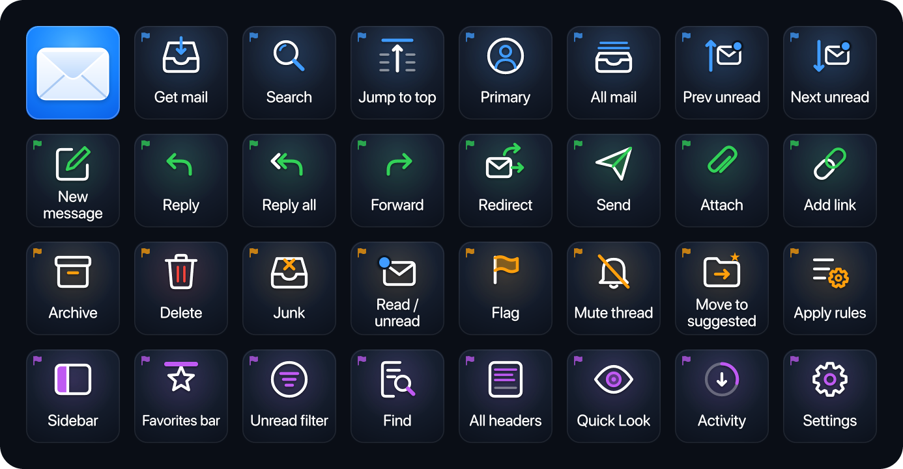

# Mail — Stream Deck XL profile

32 keys for Apple Mail 16 on macOS: mailboxes, writing, triage and view. The tiles use the dark navy of Mail's sidebar, white line glyphs and SF Pro Rounded labels. Each row is coloured with one of Mail's own flag colours (blue, green, orange and purple), and a small flag in that colour flies in each key's corner. The top-left key is Mail's envelope on the app icon's blue.



Mockup: [live](https://claude.ai/code/artifact/fdec2192-c67f-4d51-9f6f-3dc0d7ec22e0) · [local](index.html)

## Install

```bash
open -a "Elgato Stream Deck" profiles/mail/Mail.streamDeckProfile
```

- **Top-left key.** It goes back to the **Main** launcher, which has a key for every deck (a Stream Deck *Switch Profile* action). In the full setup (`npm run backup`, see the [repo README](../../README.md)) it already points at Main. If you import this file on its own, select the key in the Stream Deck app and pick your Main profile.
- **Link the profile** to Mail under **Preferences → Profiles**, so the deck switches to it when Mail is in front. The backup already links it.

## Where the shortcuts came from

- **App:** Mail 16.0 (`com.apple.mail`), in `/System/Applications/Mail.app`, on macOS 27.
- **Menu file:** `Contents/Resources/Base.lproj/MainMenu.nib`, read with `tools/nib-shortcuts.py` (112 shortcuts).
- **Live menus:** every key was then checked in the running app's menu bar through System Events (`AXMenuItemCmdChar` and `AXMenuItemCmdModifiers`). Two entries in the nib aren't in the live menus, so they're left out (see below). The menu paths below are the live ones.
- **Your settings:** there are no custom shortcuts (`NSUserKeyEquivalents` is unset for Mail and globally). The keyboard layout is British, and none of these keys needs a shifted symbol.

## Layout

| Row | 1 | 2 | 3 | 4 | 5 | 6 | 7 | 8 |
|---|---|---|---|---|---|---|---|---|
| **Mailboxes** (blue) | Mail *(Main)* | Get mail `⇧⌘N` | Search `⌥⌘F` | Jump to top `⌃⌘T` | Primary `⌥⌘1` | All mail `⌥⌘5` | Prev unread `⌃⌥⌘[` | Next unread `⌃⌥⌘]` |
| **Write** (green) | New message `⌘N` | Reply `⌘R` | Reply all `⇧⌘R` | Forward `⇧⌘F` | Redirect `⇧⌘E` | Send `⇧⌘D` | Attach `⇧⌘A` | Add link `⌘K` |
| **Triage** (orange) | Archive `⌃⌘A` | Delete `⌘⌫` | Junk `⇧⌘J` | Read / unread `⇧⌘U` | Flag `⇧⌘L` | Mute thread `⌃⇧M` | Move to suggested `⌃⌘M` | Apply rules `⌥⌘L` |
| **View** (purple) | Sidebar `⌃⌘S` | Favorites bar `⌥⇧⌘H` | Unread filter `⌘L` | Find `⌘F` | All headers `⇧⌘H` | Quick Look `⌘Y` | Activity `⌥⌘0` | Settings `⌘,` |

Menu paths:
- **Mailboxes:** Get All New Mail, Go to Mailbox Category ▸ Primary / All Mail, Go to Previous / Next Unread Mailbox (all in Mailbox); Mailbox Search and Jump to Top (Edit ▸ Find).
- **Write:** File ▸ New Message and Attach Files…; Message ▸ Reply, Reply All, Forward, Redirect and Send; Edit ▸ Add Link….
- **Triage:** Message ▸ Archive, Move to Junk, Mark as Read / Unread, Flag ▸ Toggle Flag, Mute, Move to Predicted Mailbox and Apply Rules; Edit ▸ Delete.
- **View:** View ▸ Show Sidebar, Show Favorites Bar, Filter ▸ Enable Message Filter and Message ▸ All Headers; Edit ▸ Find ▸ Find…; File ▸ Quick Look Attachments…; Window ▸ Activity; Mail ▸ Settings….

## Notes

- **Primary and All mail** only work while Mail is showing categories. In a plain mailbox view the menu items are greyed out.
- **Send** (`⇧⌘D`) sends the message you're writing. With a sent message selected, the same key is *Send Again*.
- **Read / unread** (`⇧⌘U`) toggles: the menu item reads *Mark as Read* or *Mark as Unread* depending on the selection. The Sidebar key toggles in the same way.
- **Mute thread** is `⌃⇧M`, with no ⌘. That's how Mail defines it.

## Left out

- **Open Quickly** (`⇧⌘O`). It's in the nib but not in Mail 16's live menus, so it may do nothing.
- **Full screen.** The live menu shows 🌐F, which a Stream Deck hotkey can't send. `⌃⌘F` appears only in the nib, so it wasn't used.
- **Favourite mailboxes** (`⌘1`–`⌘9`, and `⌃⌘1`–`⌃⌘9` to move messages). They depend on how you've arranged the Favorites bar.
- **Erase Junk Mail** (`⌥⌘J`) and **Erase Deleted Items** (`⇧⌘⌫`). They delete permanently with a single tap.
- **Editing and formatting** keys (bold, fonts, quote level) that work in any text field.
