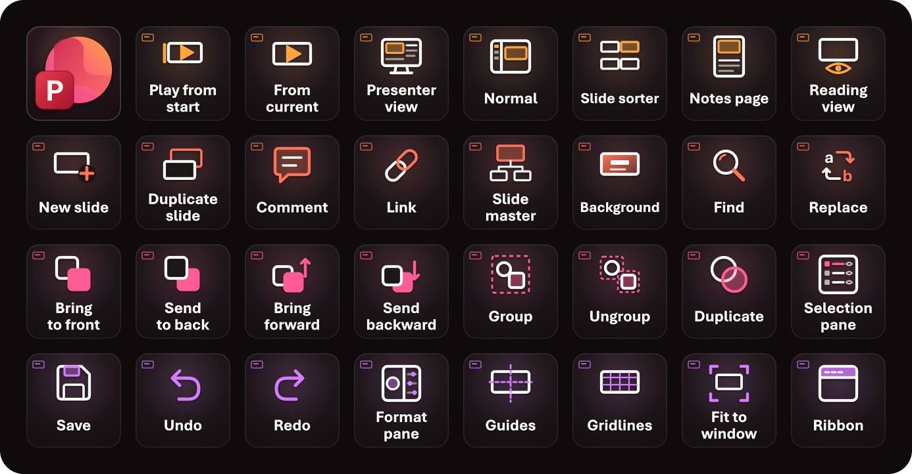

# Microsoft PowerPoint — Stream Deck XL

32 keys for PowerPoint on macOS: presenting, slides, arranging shapes, and editing and view. The tiles are a warm charcoal that leans towards the plum in PowerPoint's icon. Each row takes a colour from the icon's disc, going round from orange through coral and pink to orchid. A small slide thumbnail in the row's colour sits in the corner of every key. The top-left key is the icon itself: the folded disc with the red P badge.



Mockup: [live](https://claude.ai/code/artifact/2e92727d-ae25-4022-97e0-eb15ef3b9a7e) · [local](index.html)

## Install

```bash
open -a "Elgato Stream Deck" profiles/powerpoint/PowerPoint.streamDeckProfile
```

- **Top-left key.** It goes back to the **Main** launcher, which has a key for every deck (a Stream Deck *Switch Profile* action). In the full setup (`npm run backup`, see the [repo README](../../README.md)) it already points at Main. If you import this file on its own, select the key in the Stream Deck app and pick your Main profile.
- **Link the profile** to Microsoft PowerPoint under **Preferences → Profiles**, so the deck switches to it when PowerPoint is in front. The backup already links it.

## Where the shortcuts come from

- **App:** Microsoft PowerPoint 16.112.4 (`com.microsoft.Powerpoint`).
- **Live menu bar:** read with System Events while PowerPoint ran in the background with a new, blank presentation (`AXMenuItemCmdChar`, `AXMenuItemCmdVirtualKey` and `AXMenuItemCmdModifiers`, one level of submenus). That scratch presentation was closed without saving, and PowerPoint was quit afterwards.
- **Why the live menus.** Like Word and Excel, PowerPoint's nibs hold no key equivalents. `PowerPoint.sdef` has no key lookup like Word's `find key`. Every key on this deck is a menu item, so none needed a key test.
- **Your settings:** there are no custom shortcuts (`NSUserKeyEquivalents` is unset). The keyboard layout is British. The one symbol key, `'` for Gridlines, is on the same key as on a US layout.

## Layout

| Row | 1 | 2 | 3 | 4 | 5 | 6 | 7 | 8 |
|---|---|---|---|---|---|---|---|---|
| **Present** (orange) | PowerPoint *(Main)* | Play from start ⇧⌘↩ | From current ⌘↩ | Presenter view ⌥↩ | Normal ⌘1 | Slide sorter ⌘2 | Notes page ⌘3 | Reading view ⌘5 |
| **Slides** (coral) | New slide ⇧⌘N | Duplicate slide ⇧⌘D | Comment ⇧⌘M | Link ⌘K | Slide master ⌥⌘1 | Background ⇧⌘2 | Find ⌘F | Replace ⌃H |
| **Arrange** (pink) | Bring to front ⇧⌘F | Send to back ⇧⌘B | Bring forward ⌥⇧⌘F | Send backward ⌥⇧⌘B | Group ⌥⌘G | Ungroup ⌥⇧⌘G | Duplicate ⌘D | Selection pane ⌥⌘U |
| **Edit & view** (orchid) | Save ⌘S | Undo ⌘Z | Redo ⌘Y | Format pane ⇧⌘1 | Guides ⌃⌥⌘G | Gridlines ⌘' | Fit to window ⌥⌘O | Ribbon ⌥⌘R |

## Notes

- **Presenter view** is ⌥↩ and **Replace** is ⌃H. Neither uses ⌘; that's how PowerPoint's menus define them.
- **Redo** (⌘Y) is Office's Redo / Repeat. With nothing to undo, it repeats your last action.
- **Duplicate** (⌘D) copies the selected shape. **Duplicate slide** (⇧⌘D) copies the whole slide.
- The **Arrange** keys, **Link** and **Format pane** need a shape, picture or text to be selected.

## Left out

- **Full screen.** The live menu shows 🌐F, which a Stream Deck hotkey can't send.
- **Pick Up Object Style** (⇧⌘C) and the paste on ⇧⌘V. With nothing selected, the paste item reads *Apply To Defaults*, so what it does depends on the selection. That's too ambiguous for one key.
- **Animation Painter** (⌥⇧⌘C), **Toggle Drawing** (⌃⌘Z) and **Advanced Find** (⌃F). Rarely needed.
- **Text formatting** (bold, italic and so on). Those keys aren't in PowerPoint's menus, and they're the same in every text field.
- **Window ▸ Move & Resize** keys. These are macOS window tiling shortcuts, not PowerPoint's own.
